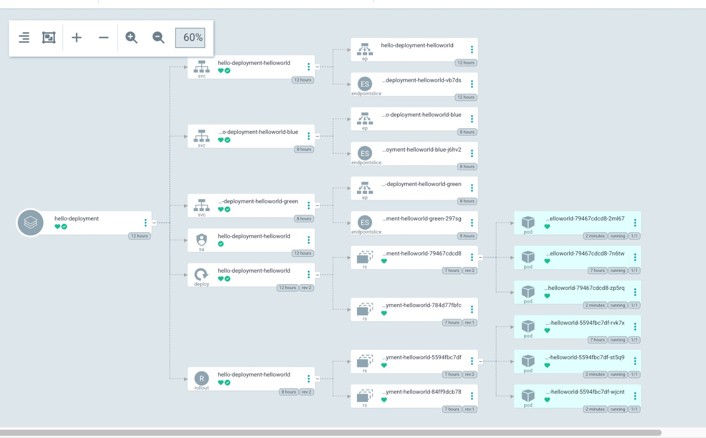
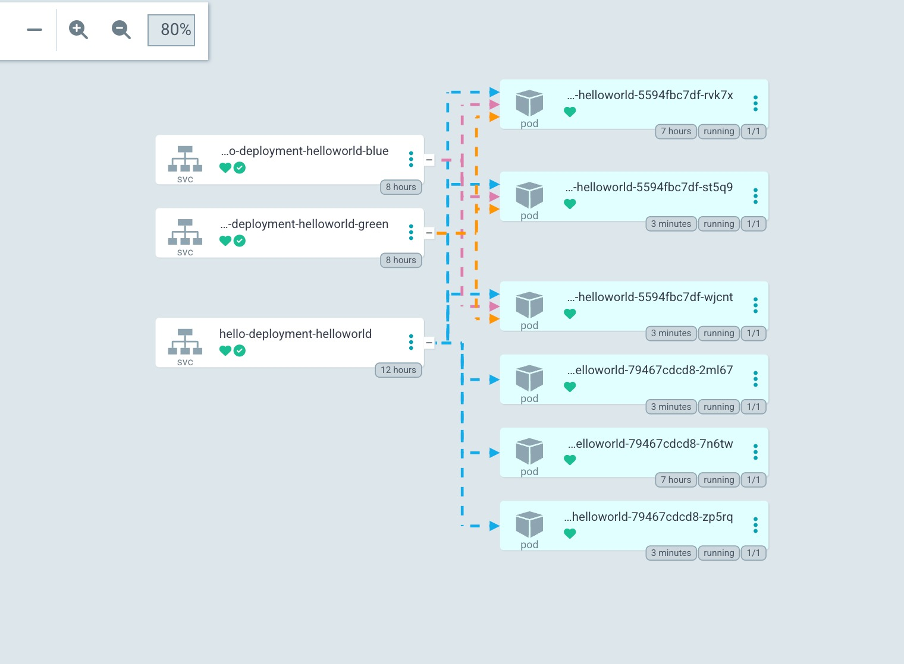
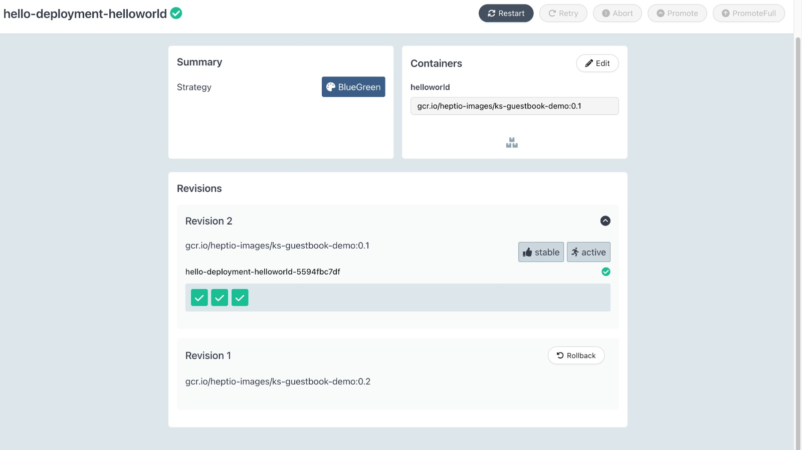

# Argocd Deployments

## Create Helm chart

```bash
helm create helloworld
```

## Start Minikube server

```bash
minikube start
```

(if not installed, install argocd)

## Kube Commands

```bash
#to get argocd services
kubectl get svc -n argocd

#portforwarding to argocd-server to access the UI
kubectl port-forward svc/argocd-server -n argocd 8080:443
```

## Login to argocd UI

```bash
# To get argocd UI password
kubectl -n argocd get secret argocd-initial-admin-secret -o jsonpath="{.data.password}" | base64 -d

# install argocd
brew install argocd

# login to argocd
argocd login 127.0.0.1:8080

# to update password
argocd account update-password --current-password curr_password --new-password new_password
```

```bash
kubectl get pods -n argo-rollouts
```

## Install argo-rollouts plugin

### Reference

https://argo-rollouts.readthedocs.io/en/stable/installation/

https://github.com/argoproj/argo-rollouts/blob/master/examples/rollout-bluegreen.yaml

https://medium.com/data-and-beyond/argo-rollouts-advanced-strategies-for-smooth-deployments-9fc1ebd64c7a#:~:text=Blue%2DGreen%20Deployments%3A%20Argo%20Rollouts,of%20downtime%20or%20issues%20during

```bash


curl -LO https://github.com/argoproj/argo-rollouts/releases/latest/download/kubectl-argo-rollouts-darwin-amd64

chmod +x ./kubectl-argo-rollouts-darwin-amd64

sudo mv ./kubectl-argo-rollouts-darwin-amd64 /usr/local/bin/kubectl-argo-rollouts

kubectl argo rollouts version

kubectl argo rollouts list rollouts

kubectl argo rollouts get rollout hello-deployment-helloworld --watch -n argocd

kubectl argo rollouts dashboard -n argocd

kubectl argo rollouts abort rollout_name

kubectl delete rollout rollout_name

# manually applying rollouts and services
kubectl apply -f deployments.yaml
kubectl apply -f rollouts.yaml
kubectl apply -f active-service.yaml
kubectl apply -f preview-service.yaml
```






### Pod failure
https://github.com/docker/compose/issues/10185
On arm64 - exec /usr/local/bin/docker-entrypoint.sh: exec format error
```bash
export DOCKER_DEFAULT_PLATFORM=linux/amd64
```